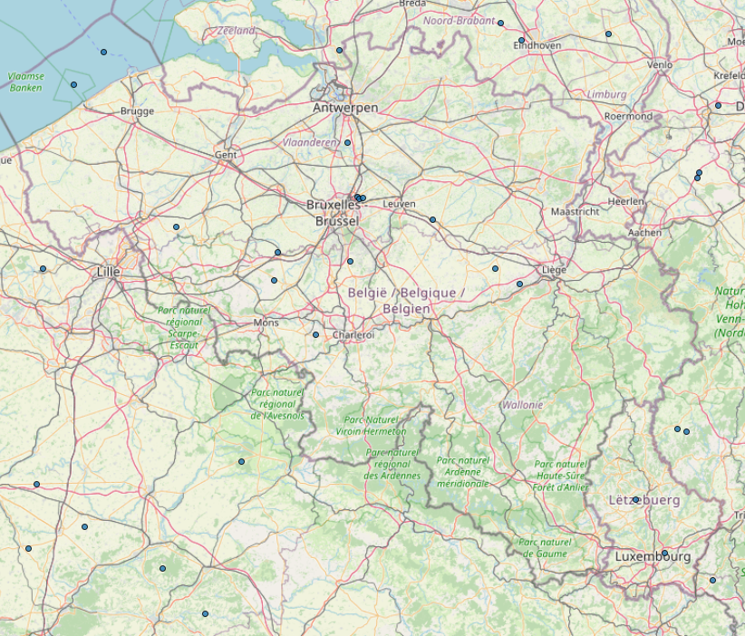

# Python scripts to load and visualize OpenSky Network air traffic data 

Load and visualize [OpenSky Network](https://opensky-network.org/) air traffic data with Python framework (geo/pandas, contextily...)

Air traffic data are either provided as JSON files from the OpenSky live REST API or requested to the OpenSky historical database with [Paramiko](http://www.paramiko.org/)

Flight data are stored as [pandas](https://pandas.pydata.org/) / [GeoPandas](http://geopandas.org/) dataframes

The map background is built with [contextily](https://github.com/darribas/contextily)

Images are built with PIL and Matplotlib

Example: plot latest tracks over France (10 positions in the last 10 minutes)

Example 2: plot trajectories of emergency helicopters over Paris (summer 2020)
 

Example 3: plot latest positions of flights over Belgium

## Running the tests

Run the different notebooks to load and visualize data:

* demo_unauthenticated_instant: load and visualize rapidly on a map latest flight positions (ex: over Belgium)

* demo_authenticated_latest: load and visualize successive positions from recent flight positions (ex: over France)

* demo_historical_database: load and visualize past flight trajectories (ex: emergency helicopters over Paris)

## Built With

* [Paramiko](http://www.paramiko.org/) - A Python implementation of SSHv2

* [pandas](https://pandas.pydata.org/) - Python Data Analysis Library

* [GeoPandas](http://geopandas.org/) - GeoPandas is an open source project which extends the datatypes used by pandas to allow spatial operations on geometric types. 

* [contextily](https://github.com/darribas/contextily) - Context geo-tiles in Python

## Version

Code tested with the following configuration: Python 3.7.4, paramiko 2.7.2, pandas 0.25.1, geopandas 0.6.3 and contextily 1.0rc2

## Authors

* **Thomas Dubot** 

## License

This project is licensed under the MIT License - see the [LICENSE.md](LICENSE.md) file for details

## Other resources

If you fail adapting these scripts to your needs, you could try to install one of the following Python libraries to access OpenSky Network data:

* [traffic](https://github.com/xoolive/traffic)

* [pyopensky](https://github.com/junzis/pyopensky)

